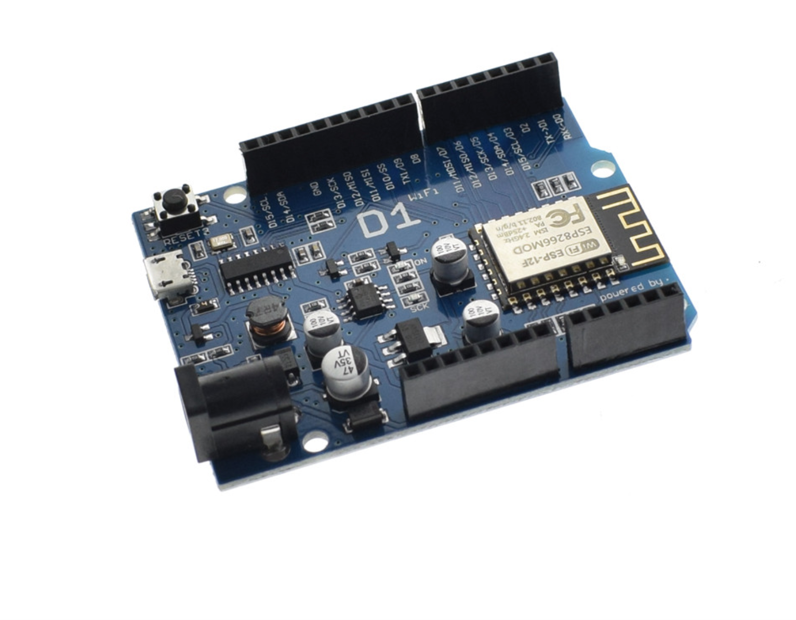

<h1>Wemos D1 R2</h1>
<h3>ESP8266 ESP12 WIFI ตัวบอร์ด แบบเดียวกับ Arduino ทำให้ใช้งานง่าย ต่อสายได้สะดวกขึ้น</h3>
<h3>กล่าวได้ว่า Wemos D1 คือ การทำให้ NodeMCU ESP8266 มาสร้างเป็นรูปแบบของ Arduino UNO R3</h3>

WeMos-D1 จึงทำให้ผู้ใช้งานสามารถต่อสายได้สะดวกขึ้น
ไม่ต้องต่อสายไฟเองเชื่อมต่อทาง USB ด้วย TTL USB Chip CH340
การอัพโหลดโปรแกรมลงบนบอร์ด เราสามารถใช้ Arudino IDE ได้เลย แต่จำเป็นต้องติดตั้ง USB Driver ของมันก่อน

<a href="">NodeMCU ESP8266 คืออะไร</a>
<a href="">Arduino UNO R3 คืออะไร</a>

<h3>การใช้งาน</h3>
<ul>
<li>ติดตั้ง Arduino IDE</li>
หากยังไม่ได้ติดตั้ง สามารถดูการติดตั้งได้ที่ <a
href="https://github.com/kprappcompile/Install-Arduino-IDE">การติดตั้ง Arduino IDE</a>
<li></li>
<li></li>
<li></li>
<li></li>
</ul>
